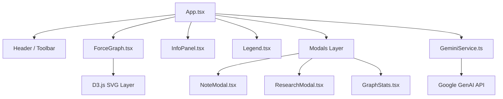
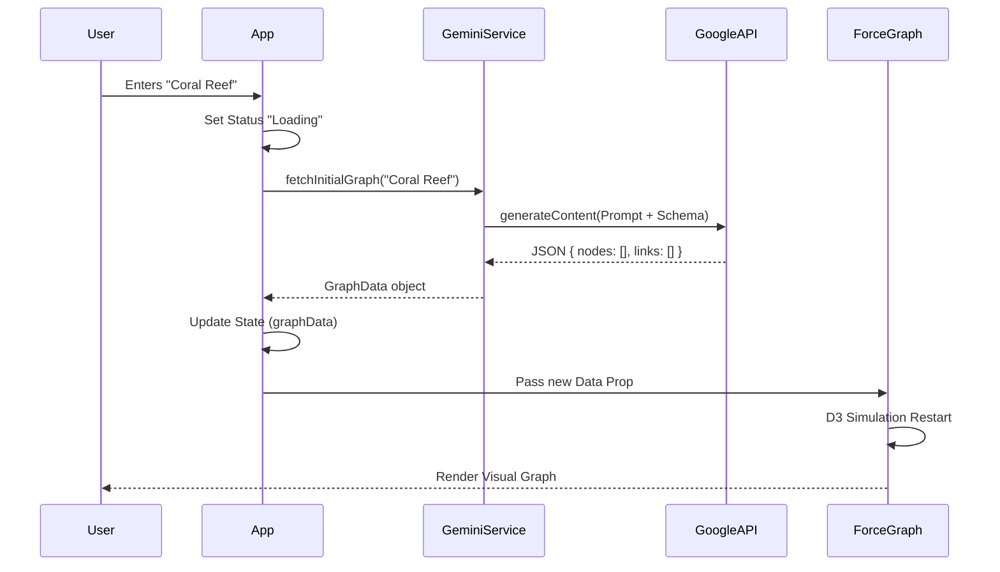
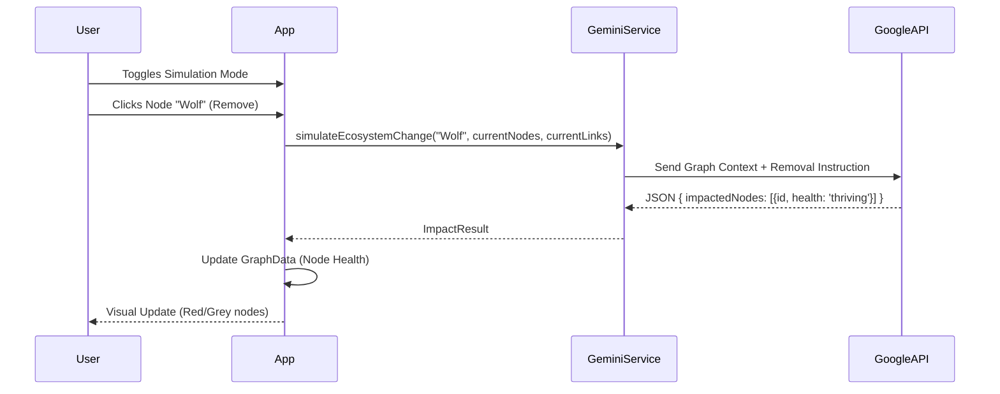
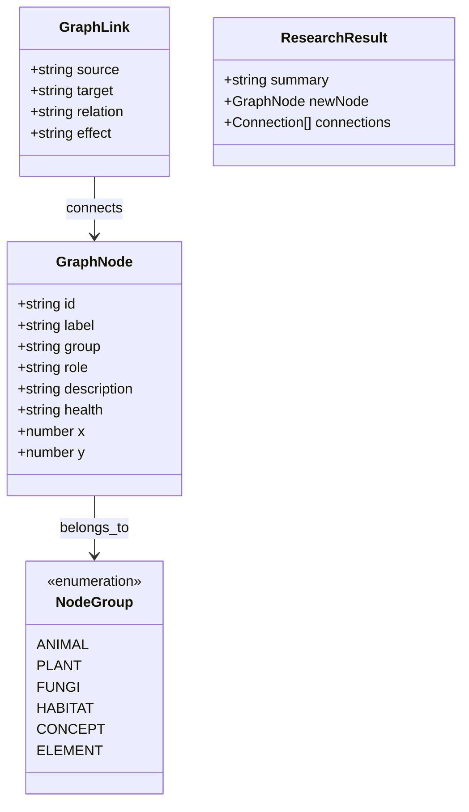

# 📊 System UML Diagrams

## 1. Component Diagram
Displays the hierarchy of the React application.

## 2. Sequence Diagram: Generating a Graph
How data flows from user input to visualization.

## 3. Sequence Diagram: Simulation Mode
The flow of an impact analysis event.

## 4. Class Diagram (Data Models)
The TypeScript interfaces defining the domain model.

